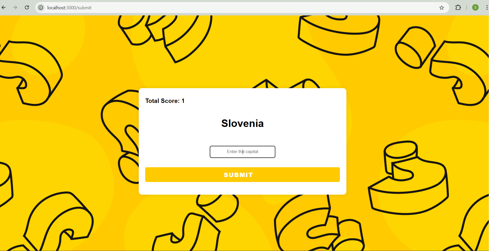

# Country-Capital Game

This is a web application that allows users to play a game where they match countries with their capitals. The backend is built with Node.js and uses PostgreSQL for the database.

## Features

- Interactive game interface to match countries with capitals
- User score tracking
- PostgreSQL database to store country-capital pairs and user scores

## Tech Stack

- **Backend**: Node.js
- **Database**: PostgreSQL

## Installation

### Prerequisites

- Node.js installed
- PostgreSQL installed and running

### Steps

1. Clone the repository:
    ```bash
    git clone https://github.com/your-username/country-capital-game.git
    cd country-capital-game
    ```

2. Install dependencies:
    ```bash
    npm install
    ```

3. Set up PostgreSQL database:
    - Create a new database.
    - Update `config.js` or `.env` with your PostgreSQL database credentials.

4. Run the application:
    ```bash
    npm start
    ```

## Usage

- Access the game via `http://localhost:3000` in your web browser.
- Start matching countries with their capitals and track your score!

## Including Pictures

```markdown


